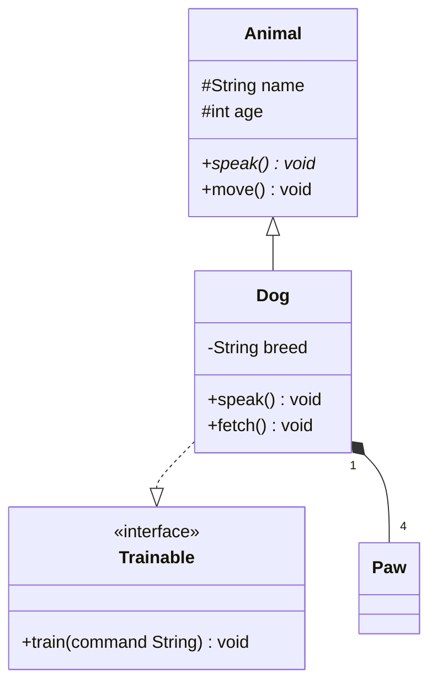

# UML Class Diagram — The Complete Guide

---

## What is a Class Diagram?

A **Class Diagram** is a type of **structural UML diagram** that describes the static structure of a system. It shows:

- The **classes** in a system
- Their **attributes** (fields / properties)
- Their **methods** (behaviors / operations)
- The **relationships** between classes

It is the **most widely used** UML diagram — in software design, documentation, code reviews, and especially **Low-Level Design (LLD) interviews**.

### What it answers:

- What are the main entities in the system?
- What data does each entity hold?
- What can each entity do?
- How are entities related to each other?

### When to use it:

|Scenario|Why Class Diagram Helps|
|---|---|
|Designing a new system|Blueprint before writing code|
|LLD interviews|Standard format for design rounds|
|Documenting existing code|Reverse-engineering a codebase|
|Code reviews|Communicate design intent clearly|
|OOP learning|Understand inheritance, polymorphism visually|

---

## Anatomy of a Class

A class is represented as a **rectangle divided into three compartments**:

```
┌─────────────────────────────────────┐
│           ClassName                 │  ← Compartment 1: Name
├─────────────────────────────────────┤
│ - attributeName : Type              │  ← Compartment 2: Attributes
│ # protectedAttr : Type = default    │
│ + publicAttr    : Type              │
├─────────────────────────────────────┤
│ + methodName(param: Type) : Return  │  ← Compartment 3: Methods
│ - privateMethod() : void            │
└─────────────────────────────────────┘
```

### Compartment 1 — Class Name

- Written in **PascalCase** (e.g., `BankAccount`, `OrderService`)
- Centered and **bold** in most tools
- Abstract class names are written in _italics_ or prefixed with `<<abstract>>`
- Stereotypes appear above the name in guillemets: `<<interface>>`, `<<enum>>`

### Compartment 2 — Attributes

Format: `visibility name : Type [= defaultValue]`

```
- balance      : double = 0.0
# accountId   : String
+ isActive    : boolean = true
/ derivedAttr : int          ← "/" prefix means derived (computed)
_ staticAttr  : String       ← underlined means static
```

### Compartment 3 — Methods (Operations)

Format: `visibility name(param: Type, ...) : ReturnType`

```
+ deposit(amount: double) : void
+ withdraw(amount: double) : boolean
- validate() : boolean
+ getBalance() : double
```

- **Static methods** are underlined
- **Abstract methods** are in _italics_
- Constructor is usually named same as the class

---

## Visibility Modifiers

|Symbol|Name|Accessible From|
|---|---|---|
|`+`|Public|Everywhere|
|`-`|Private|Within the class only|
|`#`|Protected|Class + subclasses|
|`~`|Package / Default|Classes in the same package|

### Example:

```
┌────────────────────────────────┐
│          BankAccount           │
├────────────────────────────────┤
│ - accountNumber : String       │  ← private
│ # balance : double             │  ← protected (subclasses can access)
│ + owner : String               │  ← public (anyone can access)
│ ~ bankCode : String            │  ← package-private
├────────────────────────────────┤
│ + deposit(amt: double) : void  │
│ - validate(amt: double) : bool │
│ # applyInterest() : void       │
└────────────────────────────────┘
```

---

## Types of Members

### Static Members (Underlined)

Static members belong to the **class**, not to instances.

```
┌──────────────────────────────────┐
│           Counter                │
├──────────────────────────────────┤
│ - count : int                    │  ← underlined = static
├──────────────────────────────────┤
│ + increment() : void             │
│ + getCount() : int               │  ← underlined = static method
└──────────────────────────────────┘
```

### Abstract Members (Italic)

Abstract methods have no implementation — must be overridden by subclasses.

```
┌──────────────────────────────────┐
│        <<abstract>>              │
│           Shape                  │
├──────────────────────────────────┤
│ # color : String                 │
├──────────────────────────────────┤
│ + draw() : void                  │  ← italic = abstract
│ + getArea() : double             │  ← italic = abstract
└──────────────────────────────────┘
```

### Derived Attributes (Slash prefix)

Derived attributes are **computed** from other attributes, not stored directly.

```
┌────────────────────────────────────┐
│              Rectangle             │
├────────────────────────────────────┤
│ - width  : double                  │
│ - height : double                  │
│ / area   : double                  │  ← "/" = derived (width * height)
└────────────────────────────────────┘
```

---

## Class Types & Stereotypes

UML uses **stereotypes** (in `<<guillemets>>`) to classify special kinds of classes.

### 1. Concrete Class

A regular, instantiatable class. No special notation needed.

```
┌──────────────────────────┐
│          Car             │
├──────────────────────────┤
│ - model : String         │
│ - year  : int            │
├──────────────────────────┤
│ + start() : void         │
└──────────────────────────┘
```

---

### 2. Abstract Class

Cannot be instantiated. Marked with `<<abstract>>` or italic class name.

```
┌──────────────────────────┐
│       <<abstract>>       │
│          Animal          │
├──────────────────────────┤
│ # name : String          │
├──────────────────────────┤
│ + speak() : void         │  ← abstract (italic)
│ + move()  : void         │  ← abstract (italic)
└──────────────────────────┘
```

**Rules:**

- Can have both abstract and concrete methods
- Can have attributes
- Can have constructors
- Subclasses **must** implement all abstract methods

---

### 3. Interface

Defines a **contract** — only method signatures, no implementation (in classic OOP). Marked with `<<interface>>`.

```
┌──────────────────────────┐
│       <<interface>>      │
│         Drawable         │
├──────────────────────────┤
│                          │  ← No attributes (typically)
├──────────────────────────┤
│ + draw() : void          │
│ + resize(factor: double) │
└──────────────────────────┘
```

**Differences from Abstract Class:**

|Feature|Abstract Class|Interface|
|---|---|---|
|Instantiation|No|No|
|Attributes|Yes|No (only constants)|
|Method implementation|Partial|No (pre-Java 8)|
|Multiple inheritance|No|Yes|
|Constructor|Yes|No|

---

### 4. Enumeration

A fixed set of named constants. Marked with `<<enumeration>>`.

```
┌──────────────────────────┐
│      <<enumeration>>     │
│         DayOfWeek        │
├──────────────────────────┤
│  MONDAY                  │
│  TUESDAY                 │
│  WEDNESDAY               │
│  THURSDAY                │
│  FRIDAY                  │
│  SATURDAY                │
│  SUNDAY                  │
└──────────────────────────┘
```

---

### 5. Utility / Helper Class

Contains only static methods. Marked with `<<utility>>`.

```
┌──────────────────────────┐
│        <<utility>>       │
│         MathUtils        │
├──────────────────────────┤
│                          │
├──────────────────────────┤
│ + sqrt(n: double): double│  ← all static (underlined)
│ + abs(n: int)   : int    │
└──────────────────────────┘
```

---

### 6. Singleton

Only one instance exists. Marked with `<<Singleton>>`. Has a static `instance` attribute and a static `getInstance()` method.

```
┌──────────────────────────────┐
│         <<Singleton>>        │
│        DatabaseConnection    │
├──────────────────────────────┤
│ - instance: DBConnection     │  ← static (underlined)
│ - url: String                │
├──────────────────────────────┤
│ + getInstance(): DBConnection│  ← static (underlined)
│ - DatabaseConnection()       │  ← private constructor
│ + query(sql: String): Result │
└──────────────────────────────┘
```

---

## Relationships — Overview

This is the **most critical** part of a class diagram. Six types of relationships exist, differing in strength and semantics.

### Visual Summary

```
Strength:  WEAKEST ◄──────────────────────────────────► STRONGEST

Dependency    Association    Aggregation    Composition
 - - -▶         ─────▶         ◇─────         ◆─────

                    Inheritance        Realization
                      ─────▷            - - -▷
```

### Comparison Table

|Relationship|Arrow|Strength|Key Question|Example|
|---|---|---|---|---|
|**Dependency**|`- - ->`|Weakest|Does A use B temporarily?|Method uses Logger|
|**Association**|`──────>`|Weak|Does A know about B?|Teacher knows Students|
|**Aggregation**|`◇──────`|Medium|Does A have B (B survives A)?|Team has Players|
|**Composition**|`◆──────`|Strong|Does A own B (B dies with A)?|House has Rooms|
|**Realization**|`- - -▷`|—|Does A implement B's contract?|Dog implements Animal|
|**Inheritance**|`──────▷`|—|Is A a type of B?|Dog is an Animal|

---

## 1. Inheritance (Generalization)

### What it means:

"IS-A" relationship. The child class **inherits** all attributes and methods of the parent class and can override or extend them.

### Arrow:

Solid line with a **hollow triangle arrowhead** pointing to the **parent (superclass)**.

```
        ┌──────────────────────────┐
        │       <<abstract>>       │
        │          Person          │
        ├──────────────────────────┤
        │ # name  : String         │
        │ # age   : int            │
        ├──────────────────────────┤
        │ + getName() : String     │
        │ + toString(): String     │
        └──────────────────────────┘
                    ▲
         ┌──────────┴─────────┐
         │                    │
┌────────────────┐   ┌─────────────────┐
│    Student     │   │    Teacher      │
├────────────────┤   ├─────────────────┤
│ - studentId    │   │ - employeeId    │
│ - gpa : double │   │ - subject:String│
├────────────────┤   ├─────────────────┤
│ + enroll()     │   │ + teach()       │
│ + study()      │   │ + grade()       │
└────────────────┘   └─────────────────┘
```

### Rules:

- A child class **inherits** all non-private members of parent
- A child can **override** parent methods
- A class can only inherit from **one** parent (Java, C#) — single inheritance
- In C++, multiple inheritance is allowed
- Abstract methods in parent **must** be implemented in concrete child classes

---

## 2. Realization (Interface Implementation)

### What it means:

A class **realizes** (implements) an interface — it commits to fulfilling the contract defined by the interface.

### Arrow:

**Dashed line** with a **hollow triangle arrowhead** pointing to the **interface**.

```
      ┌─────────────────────────────┐
      │         <<interface>>       │
      │           Flyable           │
      ├─────────────────────────────┤
      │                             │
      ├─────────────────────────────┤
      │ + fly() : void              │
      │ + land() : void             │
      └─────────────────────────────┘
                    ▲
        ┌───────────┴──────────┐
     (dashed)               (dashed)
        │                      │
┌─────────────┐       ┌──────────────┐
│    Bird     │       │   Airplane   │
├─────────────┤       ├──────────────┤
│ - wingSpan  │       │ - model      │
├─────────────┤       ├──────────────┤
│ + fly()     │       │ + fly()      │
│ + land()    │       │ + land()     │
└─────────────┘       └──────────────┘
```

### Rules:

- A class can implement **multiple** interfaces
- The implementing class **must** provide a body for every method in the interface
- Interfaces cannot be instantiated

---

## 3. Association

### What it means:

A general structural relationship where one class **knows about** or **uses** another. It implies objects of one class hold a reference to objects of another class.

### Arrow:

**Solid line**, optionally with an **open arrowhead** indicating direction.

```
Bidirectional (both know each other):
┌──────────┐                ┌──────────┐
│ Teacher  │ ────────────── │ Student  │
└──────────┘                └──────────┘

Unidirectional (Teacher knows Student, not vice versa):
┌──────────┐                ┌──────────┐
│ Teacher  │ ──────────────▶│ Student  │
└──────────┘  teaches       └──────────┘
```

### Association with Roles and Multiplicity:

```
        employer          employee
┌─────────────┐  1    *  ┌──────────────┐
│   Company   │──────────│   Employee   │
└─────────────┘          └──────────────┘
```

### Association Class:

When the relationship itself has attributes, use an **Association Class**:

```
┌──────────┐                  ┌──────────┐
│ Student  │──────────────────│  Course  │
└──────────┘  *          *    └──────────┘
                    │
                    │ (association class)
              ┌─────────────┐
              │ Enrollment  │
              ├─────────────┤
              │ - grade: A  │
              │ - date: Date│
              └─────────────┘
```

---

## 4. Aggregation

### What it means:

"HAS-A" relationship — **weak ownership**. The parent (whole) contains children (parts), but the children **can exist independently** of the parent.

If the parent is destroyed, the children **survive**.

### Arrow:

Solid line with a **hollow diamond** (`◇`) on the **whole/parent** side.

```
   Whole side ◇                      Part side
┌──────────────┐ ◇──────────────── ┌──────────────┐
│    Team      │    1          *   │    Player    │
├──────────────┤                   ├──────────────┤
│ - teamName   │                   │ - playerName │
│ - players    │                   │ - position   │
├──────────────┤                   ├──────────────┤
│ + addPlayer()│                   │ + play()     │
└──────────────┘                   └──────────────┘
```

**Key insight**: A Player can exist without a Team (e.g., a free agent). If the Team is disbanded (deleted), the Players still exist in the system.

### More Examples:

```
Library ◇────── Book         (Book can exist in multiple libraries)
University ◇─── Department   (Department can be transferred)
Playlist ◇───── Song         (Song can be in many playlists)
```

---

## 5. Composition

### What it means:

"HAS-A" relationship — **strong ownership**. The parent (whole) **exclusively owns** the children (parts). The children **cannot exist** without the parent.

If the parent is destroyed, all children are **destroyed too**.

### Arrow:

Solid line with a **filled/solid diamond** (`◆`) on the **whole/parent** side.

```
   Whole side ◆                      Part side
┌──────────────┐ ◆──────────────── ┌──────────────┐
│    House     │    1       1..*   │     Room     │
├──────────────┤                   ├──────────────┤
│ - address    │                   │ - roomNumber │
│ - rooms      │                   │ - area       │
├──────────────┤                   ├──────────────┤
│ + addRoom()  │                   │ + getArea()  │
└──────────────┘                   └──────────────┘
```

**Key insight**: A Room doesn't make sense without a House. If a House is demolished, all its Rooms cease to exist.

### More Examples:

```
Order ◆──────── OrderItem     (OrderItem can't exist without an Order)
Human ◆──────── Heart         (Heart belongs to exactly one Human)
Document ◆───── Paragraph     (Paragraph lives inside one Document)
Car ◆────────── Engine        (Engine is part of one Car)
```

---

### Aggregation vs. Composition — Side-by-Side

```
AGGREGATION (weak)                    COMPOSITION (strong)
   ◇────────────                         ◆────────────

┌──────────┐ ◇──── ┌──────────┐      ┌──────────┐ ◆──── ┌──────────┐
│  Course  │       │ Student  │      │   Body   │       │   Organ  │
└──────────┘       └──────────┘      └──────────┘       └──────────┘

Student can enroll in                Organ cannot exist
multiple courses and                 without a Body. If
exists independently.                Body is gone, Organ
                                     is gone too.
```

||Aggregation `◇`|Composition `◆`|
|---|---|---|
|Ownership|Shared|Exclusive|
|Lifetime|Part outlives whole|Part dies with whole|
|Part in multiple wholes?|Yes|No|
|Diamond|Hollow|Filled|
|Real-world analogy|Team–Player|House–Room|

---

## 6. Dependency

### What it means:

The **weakest** relationship. Class A **depends on** Class B — it uses B as a method parameter, local variable, or return type. If B changes, A **may** need to change.

This does NOT mean A holds a reference to B as an attribute.

### Arrow:

**Dashed line** with an **open arrowhead** pointing to the depended-upon class.

```
┌──────────────────┐               ┌──────────────────┐
│   OrderService   │ - - - - - -▶  │     Logger       │
├──────────────────┤   <<uses>>    ├──────────────────┤
│                  │               │                  │
├──────────────────┤               ├──────────────────┤
│ + placeOrder()   │               │ + log(msg:String)│
│   uses Logger    │               └──────────────────┘
└──────────────────┘
```

### Common Dependency Stereotypes:

|Stereotype|Meaning|
|---|---|
|`<<use>>`|A uses B (default)|
|`<<create>>`|A creates instances of B|
|`<<call>>`|A calls methods on B|
|`<<instantiate>>`|A instantiates B|
|`<<import>>`|A imports B's namespace|

---

## Multiplicity

Multiplicity defines **how many instances** of one class can be associated with instances of another.

### Notation (placed at each end of a relationship line):

|Notation|Meaning|
|---|---|
|`1`|Exactly one|
|`0..1`|Zero or one (optional)|
|`*` or `0..*`|Zero or more|
|`1..*`|One or more (at least one)|
|`2..5`|Between 2 and 5 (inclusive)|
|`n`|Exactly n|

### How to Read It:

```
     1                    *
┌─────────┐ ─────────── ┌─────────┐
│ Company │             │Employee │
└─────────┘             └─────────┘

Read as: "One Company has zero or more Employees"
         "Each Employee works for exactly one Company"
```

### More Examples:

```
Customer (1) ──────── Order (0..*)
"One customer can place zero or more orders"
"Each order belongs to exactly one customer"

Doctor (1) ──────── Patient (1..*)
"One doctor can have one or more patients"
"Each patient has exactly one assigned doctor"

Student (*) ──────── Course (*)
"A student can enroll in many courses"
"A course can have many students"
```

### Multiplicity Placement:

```
┌──────────┐  1     0..*  ┌──────────┐
│  Parent  │──────────────│  Child   │
└──────────┘              └──────────┘
   ^                           ^
   Multiplicity near Parent    Multiplicity near Child
   = "how many parents         = "how many children
     per child"                  per parent"
```

---

## Constraints and Notes

### Constraints

Constraints are conditions that must be true, enclosed in `{ }`.

```
┌────────────────────────────────┐
│           Account              │
├────────────────────────────────┤
│ - balance : double {balance≥0} │  ← inline constraint
└────────────────────────────────┘
```

Or attached with a dashed line:

```
┌──────────┐              ┌──────────┐
│  Person  │──────────────│  Person  │
│ (parent) │              │ (child)  │
└──────────┘              └──────────┘
       ╲
        ╲ {age of parent > age of child}  ← constraint note
```

### Notes / Comments

Folded rectangle attached with a dashed line:

```
┌────────────────────────┐       ╔════════════════════════╗
│      BankAccount       │ - - - ║  Note: balance should  ║
├────────────────────────┤       ║  never go negative.    ║
│ - balance: double      │       ║  Throw exception if    ║
└────────────────────────┘       ║  withdrawal > balance. ║
                                 ╚════════════════════════╝
```

---

## Advanced Concepts

### 1. Template / Generic Classes

```
┌────────────────────────┐
│     Stack<T>           │  ← T is the type parameter
├────────────────────────┤
│ - elements: List<T>    │
├────────────────────────┤
│ + push(item: T): void  │
│ + pop(): T             │
│ + peek(): T            │
└────────────────────────┘
```

---

### 2. Abstract Class vs Interface — Decision Guide

```
Use ABSTRACT CLASS when:
   ✅ You want to share code (method implementations) among subclasses
   ✅ Subclasses share a common state (attributes)
   ✅ You want to use access modifiers (protected, private)
   ✅ "IS-A" relationship makes semantic sense

Use INTERFACE when:
   ✅ You want to define a capability/behavior contract
   ✅ Unrelated classes need the same behavior
   ✅ You need multiple "inheritance"
   ✅ "CAN-DO" relationship (Flyable, Serializable, Comparable)
```

---

### 3. Nested Classes

```
┌────────────────────────────────────┐
│             LinkedList             │
├────────────────────────────────────┤
│ - head : Node                      │
│ - size : int                       │
├────────────────────────────────────┤
│ + add(data: T): void               │
│ + remove(index: int): T            │
│                                    │
│  ┌──────────────────────────────┐  │
│  │     <<inner class>> Node     │  │  ← Nested class shown inside
│  ├──────────────────────────────┤  │
│  │ - data : T                   │  │
│  │ - next : Node                │  │
│  └──────────────────────────────┘  │
└────────────────────────────────────┘
```

---

### 4. Multiple Interfaces

A class can realize multiple interfaces:

```
      <<interface>>         <<interface>>
      ┌──────────┐          ┌──────────┐
      │ Flyable  │          │Swimmable │
      └──────────┘          └──────────┘
           ▲                     ▲
           └──────────┬──────────┘
                   (dashed)
                      │
               ┌──────────────┐
               │     Duck     │
               └──────────────┘
```

---

### 5. Design Patterns in Class Diagrams

#### Strategy Pattern

```
┌────────────────────────────────┐
│           Context              │
├────────────────────────────────┤
│ - strategy: SortStrategy       │
├────────────────────────────────┤
│ + setStrategy(s:SortStrategy)  │
│ + executeSort(): void          │
└────────────────────────────────┘
              │ ◆
              │ uses
              ▼
    ┌─────────────────────┐
    │    <<interface>>    │
    │    SortStrategy     │
    ├─────────────────────┤
    │ + sort(data:int[])  │
    └─────────────────────┘
              ▲
     ┌────────┴────────────┐
     │                     │
┌─────────────┐     ┌─────────────┐
│ BubbleSort  │     │  QuickSort  │
├─────────────┤     ├─────────────┤
│ + sort()    │     │ + sort()    │
└─────────────┘     └─────────────┘
```

#### Observer Pattern

```
┌───────────────────────────────┐
│          <<interface>>        │
│            Observer           │
├───────────────────────────────┤
│ + update(event: Event): void  │
└───────────────────────────────┘
             ▲
    ┌─────────┴─────────┐
    │                   │
┌────────────┐  ┌────────────────┐
│ EmailAlert │  │  SMSAlert      │
└────────────┘  └────────────────┘

┌───────────────────────────────────┐
│             Subject               │
├───────────────────────────────────┤
│ - observers: List<Observer>       │
├───────────────────────────────────┤
│ + register(o: Observer): void     │
│ + deregister(o: Observer): void   │
│ + notifyAll(): void               │
└───────────────────────────────────┘
       │ ◇
       │ has
       ▼ 1..*
  Observer (interface above)
```

#### Factory Pattern

```
┌─────────────────────────────────────┐
│            <<interface>>            │
│            Notification             │
├─────────────────────────────────────┤
│ + send(message: String): void       │
└─────────────────────────────────────┘
              ▲
    ┌─────────┴─────────────┐
    │           │           │
┌───────┐  ┌───────┐  ┌──────────┐
│ Email │  │  SMS  │  │  Push    │
│Notif. │  │Notif. │  │  Notif.  │
└───────┘  └───────┘  └──────────┘

┌─────────────────────────────────────┐
│       NotificationFactory           │
├─────────────────────────────────────┤
│                                     │
├─────────────────────────────────────┤
│ + create(type:String):Notification  │
└─────────────────────────────────────┘
```

---

## Common Mistakes

### Mistake 1 — Confusing Aggregation and Composition

❌ Wrong: Using composition when parts can exist independently.

```
Person ◆──── Address   ← WRONG if Address can be shared
```

✅ Correct: Address can be shared and reused.

```
Person ◇──── Address   ← RIGHT (aggregation)
```

---

### Mistake 2 — Wrong Arrow Direction for Inheritance

❌ Wrong: Arrow pointing TO the child.

```
Animal ◄───── Dog   ← WRONG
```

✅ Correct: Arrow points TO the parent (superclass).

```
Animal ◄─────▷ Dog   ← Wait, let's clarify:
```

The hollow triangle `▷` points toward the **parent**:

```
Dog ──────────▷ Animal   ← Arrow FROM child TO parent
```

---

### Mistake 3 — Missing Multiplicity

❌ Wrong: No multiplicity specified.

```
┌──────────┐ ─────── ┌──────────┐
│ Customer │         │  Order   │
└──────────┘         └──────────┘
```

✅ Correct: Always specify multiplicities.

```
┌──────────┐ 1   0..* ┌──────────┐
│ Customer │──────────│  Order   │
└──────────┘          └──────────┘
```

---

### Mistake 4 — Overloading a Single Diagram

❌ Wrong: Putting every class in the system into one diagram — unreadable.

✅ Correct: Break into focused diagrams per module or feature area.

---

### Mistake 5 — Using Association when Composition is Right

❌ Wrong: Using a plain line for an owner-owned relationship.

```
Order ──────── OrderItem
```

✅ Correct: OrderItem cannot exist without Order.

```
Order ◆──────── OrderItem
```

---

### Mistake 6 — Putting Method Bodies in Diagrams

❌ Wrong: Showing implementation detail.

```
+ calculateTax(): double {
    return amount * 0.18;
}
```

✅ Correct: Only signature and return type.

```
+ calculateTax(): double
```

---

## Full Case Study — Library Management System

### Requirements:

- A Library has multiple Branches
- Each Branch has Books, Members, and Librarians
- Members can borrow Books and pay Fines
- Each Borrow creates a BorrowRecord
- Books have BookItems (physical copies)
- A notification is sent when a Book is returned

```
┌──────────────────────────┐
│      <<enumeration>>     │
│       MemberStatus       │
├──────────────────────────┤
│  ACTIVE                  │
│  SUSPENDED               │
│  EXPIRED                 │
└──────────────────────────┘

┌──────────────────────────┐
│      <<enumeration>>     │
│        BookStatus        │
├──────────────────────────┤
│  AVAILABLE               │
│  BORROWED                │
│  RESERVED                │
│  LOST                    │
└──────────────────────────┘

         ┌─────────────────────────────────┐
         │           <<abstract>>          │
         │             Person              │
         ├─────────────────────────────────┤
         │ # personId : String             │
         │ # name     : String             │
         │ # email    : String             │
         │ # phone    : String             │
         ├─────────────────────────────────┤
         │ + getDetails() : String         │
         └─────────────────────────────────┘
                         ▲
              ┌──────────┴───────────┐
              │                      │
┌─────────────────────┐  ┌──────────────────────┐
│       Member        │  │      Librarian        │
├─────────────────────┤  ├──────────────────────┤
│ - memberId : String │  │ - employeeId: String  │
│ - status:MemberStatus│ │ - branch: Branch      │
│ - totalBorrowed: int│  ├──────────────────────┤
├─────────────────────┤  │ + addBook()           │
│ + borrowBook()      │  │ + removeBook()        │
│ + returnBook()      │  │ + issueBorrowCard()   │
│ + payFine()         │  └──────────────────────┘
└─────────────────────┘

┌──────────────────────────────────────┐
│               Library                │
├──────────────────────────────────────┤
│ - name      : String                 │
│ - branches  : List<Branch>           │
├──────────────────────────────────────┤
│ + getBranch(id: String) : Branch     │
│ + searchBook(title: String): Book[]  │
└──────────────────────────────────────┘
               ◆  1
               │
               │  1..*
┌──────────────────────────────────────┐
│               Branch                 │
├──────────────────────────────────────┤
│ - branchId  : String                 │
│ - address   : String                 │
├──────────────────────────────────────┤
│ + getAvailableBooks(): BookItem[]    │
└──────────────────────────────────────┘
        ◆  1           ◆  1
        │               │
       1..*             1..*
       │                 │
┌──────────────┐   ┌──────────────────┐
│     Book     │   │   BorrowRecord   │
├──────────────┤   ├──────────────────┤
│ - isbn       │   │ - recordId       │
│ - title      │   │ - borrowDate     │
│ - author     │   │ - dueDate        │
│ - genre      │   │ - returnDate     │
├──────────────┤   │ - fine: double   │
│ + getItems() │   ├──────────────────┤
└──────────────┘   │ + calculateFine()│
      ◆ 1          └──────────────────┘
      │                    │
      │ 1..*               │ *         1
┌──────────────┐           └──────────── Member
│  BookItem    │
├──────────────┤
│ - itemId     │
│ - status:BookStatus
│ - rackNo     │
├──────────────┤
│ + checkout() │
│ + checkin()  │
└──────────────┘

┌──────────────────────────────┐
│         <<interface>>        │
│         Notifiable           │
├──────────────────────────────┤
│ + sendNotification(msg:String│
└──────────────────────────────┘
              ▲
    ┌─────────┴──────────┐
    │                    │
┌───────────┐   ┌──────────────┐
│EmailNotif.│   │  SMSNotif.   │
└───────────┘   └──────────────┘
```

---

## Full Case Study — Food Delivery App

### Requirements:

- Customers place Orders from Restaurants
- Orders contain multiple OrderItems
- Each OrderItem maps to a MenuItem
- DeliveryAgent delivers the Order
- Payment is processed via a PaymentStrategy
- Order goes through multiple statuses

```
┌──────────────────────────┐
│      <<enumeration>>     │
│        OrderStatus       │
├──────────────────────────┤
│  PLACED                  │
│  CONFIRMED               │
│  PREPARING               │
│  OUT_FOR_DELIVERY        │
│  DELIVERED               │
│  CANCELLED               │
└──────────────────────────┘

┌──────────────────────────┐
│      <<enumeration>>     │
│       PaymentMethod      │
├──────────────────────────┤
│  CREDIT_CARD             │
│  UPI                     │
│  CASH_ON_DELIVERY        │
│  WALLET                  │
└──────────────────────────┘

┌──────────────────────────────────────┐
│              Customer                │
├──────────────────────────────────────┤
│ - customerId : String                │
│ - name       : String                │
│ - phone      : String                │
│ - addresses  : List<Address>         │
├──────────────────────────────────────┤
│ + placeOrder(r:Restaurant): Order    │
│ + getOrderHistory(): Order[]         │
└──────────────────────────────────────┘
        │ 1
        │  places
        ▼ 0..*
┌──────────────────────────────────────┐
│                Order                 │
├──────────────────────────────────────┤
│ - orderId    : String                │
│ - status     : OrderStatus           │
│ - placedAt   : DateTime              │
│ - totalAmount: double                │
├──────────────────────────────────────┤
│ + cancel()         : void            │
│ + getTotal()       : double          │
│ + updateStatus(s)  : void            │
└──────────────────────────────────────┘
       ◆ 1              ◆ 1
       │                │
      1..*               1
┌──────────────┐   ┌────────────────────┐
│  OrderItem   │   │     Payment        │
├──────────────┤   ├────────────────────┤
│ - quantity   │   │ - paymentId        │
│ - unitPrice  │   │ - amount: double   │
├──────────────┤   │ - method:PayMethod │
│ + getSubtotal│   ├────────────────────┤
└──────────────┘   │ + process(): bool  │
       │           └────────────────────┘
       │ *
       │ refers to
       ▼ 1
┌──────────────────────────────────────┐
│               MenuItem               │
├──────────────────────────────────────┤
│ - itemId     : String                │
│ - name       : String                │
│ - price      : double                │
│ - category   : String                │
│ - available  : boolean               │
├──────────────────────────────────────┤
│ + isAvailable(): boolean             │
└──────────────────────────────────────┘
       │ *
       │ belongs to
       ▼ 1
┌──────────────────────────────────────┐
│             Restaurant               │
├──────────────────────────────────────┤
│ - restaurantId : String              │
│ - name         : String              │
│ - address      : Address             │
│ - rating       : double              │
│ - menu         : List<MenuItem>      │
├──────────────────────────────────────┤
│ + getMenu()    : MenuItem[]          │
│ + acceptOrder(): void                │
└──────────────────────────────────────┘

┌──────────────────────────────────────┐
│            DeliveryAgent             │
├──────────────────────────────────────┤
│ - agentId   : String                 │
│ - name      : String                 │
│ - isAvailable: boolean               │
│ - location  : GPS                    │
├──────────────────────────────────────┤
│ + acceptDelivery(o: Order): void     │
│ + updateLocation(g: GPS): void       │
│ + markDelivered(o: Order): void      │
└──────────────────────────────────────┘
         │ 1
         │ delivers
         ▼ 0..*
       Order (see above)

┌──────────────────────────────────────┐
│          <<interface>>               │
│         PaymentStrategy              │
├──────────────────────────────────────┤
│ + pay(amount: double): boolean       │
│ + refund(txnId: String): boolean     │
└──────────────────────────────────────┘
              ▲
    ┌─────────┼─────────┐
    │         │         │
┌────────┐ ┌─────┐ ┌──────────┐
│ UPI    │ │Card │ │  Wallet  │
│Payment │ │Pymt │ │ Payment  │
└────────┘ └─────┘ └──────────┘
```

---

## Class Diagram in PlantUML & Mermaid

### PlantUML Syntax

PlantUML generates diagrams from text. Paste in [plantuml.com](https://www.plantuml.com/plantuml/uml).

```plantuml
@startuml

' Abstract class
abstract class Animal {
  # name: String
  # age: int
  + {abstract} speak(): void
  + move(): void
}

' Concrete class inheriting Animal
class Dog {
  - breed: String
  + speak(): void
  + fetch(): void
}

' Interface
interface Trainable {
  + train(command: String): void
}

' Enum
enum Status {
  ACTIVE
  INACTIVE
}

' Relationships
Animal <|-- Dog          ' Inheritance
Dog ..|> Trainable       ' Realization (dashed)
Dog --> Status           ' Association
Dog "1" *-- "1..*" Paw  ' Composition with multiplicity

@enduml
```

### PlantUML Relationship Syntax

|Relationship|Syntax|
|---|---|
|Inheritance|`Parent <|
|Realization|`Interface <|
|Composition|`Whole *-- Part`|
|Aggregation|`Whole o-- Part`|
|Association|`ClassA --> ClassB`|
|Dependency|`ClassA ..> ClassB`|

---

### Mermaid Syntax

Mermaid works natively in GitHub README files, Notion, and Obsidian.

````markdown

````

---

## Quick Reference Cheat Sheet

### Class Box Format

```
┌─────────────────────────────┐
│    [<<stereotype>>]         │
│       ClassName             │
├─────────────────────────────┤
│ [visibility] name : Type    │
│    [= defaultValue]         │
├─────────────────────────────┤
│ [visibility] method(params) │
│    : ReturnType             │
└─────────────────────────────┘
```

### Visibility Symbols

|Symbol|Meaning|
|---|---|
|`+`|Public|
|`-`|Private|
|`#`|Protected|
|`~`|Package|

### Special Member Notation

|Notation|Meaning|
|---|---|
|Underlined|Static|
|Italic|Abstract|
|`/` prefix|Derived|

### Stereotypes

|Stereotype|Meaning|
|---|---|
|`<<abstract>>`|Abstract class|
|`<<interface>>`|Interface|
|`<<enumeration>>`|Enum|
|`<<utility>>`|Static utility|
|`<<Singleton>>`|Singleton|
|`<<dataType>>`|Value type|

### Relationships

|Relationship|Arrow|Meaning|
|---|---|---|
|Inheritance|`──────▷`|IS-A|
|Realization|`- - -▷`|Implements interface|
|Composition|`◆──────`|Owns (strong)|
|Aggregation|`◇──────`|Has (weak)|
|Association|`──────▶`|Knows / Uses|
|Dependency|`- - -▶`|Temporarily uses|

### Multiplicity

|Notation|Meaning|
|---|---|
|`1`|Exactly one|
|`0..1`|Optional (zero or one)|
|`*`|Zero or more|
|`1..*`|One or more|
|`m..n`|Between m and n|

---

_For the complete UML specification, see [https://www.omg.org/spec/UML/](https://www.omg.org/spec/UML/)_